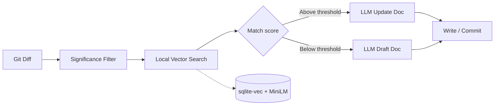

# DocuSync

> **⚠️ Project Status: Completed & Unmaintained**
>
> DocuSync was built as a solo project to solve a specific problem. It is fully functional and stable. However, due to full-time work and family commitments, this repository is not actively maintained.
>
> I will not be reviewing issues or feature requests.
>
> Pull Requests that fix critical bugs are welcome, but review times may be very slow.
>
> You are completely free to fork this repository and build your own version under the MIT License!

**Stop documentation rot before it ships.** DocuSync watches your git diffs, filters what actually matters, maps code changes to the right markdown with **local embeddings** (no vector DB bill), and uses an LLM only where docs need a surgical rewrite—or a new draft when nothing exists yet.

---

## How it works



1. **Git diff** — Compare staged changes or a PR base/head range.
2. **Significance filter** — Ignore noise (tiny diffs, tests-only edits, ignored globs).
3. **Local vector search** — Embed code hunks and doc chunks on-device; find the best markdown match.
4. **LLM** — Structured `generateObject` output updates existing pages or creates drafts; low-confidence updates are skipped.

---

## Quick start

### Prerequisites

- **Node.js 20+**
- An LLM API key **or** [Ollama](https://ollama.com) for offline models
- A git repository with markdown under `docs/` (configurable)

### Install and run locally

```bash
# Scaffold config (strips comments from the template into valid JSON)
npx docusync init

# Index your documentation corpus (first run downloads the embedding model)
npx docusync index-docs

# Dry-run the full pipeline on staged changes
npx docusync run --dry-run --staged

# Apply updates for real
npx docusync run --staged
```

Set provider credentials in the environment (never commit keys):

```bash
export OPENAI_API_KEY=sk-...
# or
export ANTHROPIC_API_KEY=sk-ant-...
```

Enable debug logs:

```bash
npx docusync run --verbose
# or
export DOCUSYNC_VERBOSE=1
```

### Offline with Ollama

```bash
ollama pull llama3.2
export DOCUSYNC_LLM_PROVIDER=ollama
```

In `docusync.json`, set `llm.provider` to `"ollama"` and `llm.model` to your local tag. Embeddings still run locally via `@huggingface/transformers`.

---

## GitHub Action

Add `.github/workflows/docusync.yml`:

```yaml
name: DocuSync

on:
  pull_request:
    types: [opened, synchronize, reopened]

permissions:
  # Required so the action can commit doc updates back to the PR branch
  contents: write
  pull-requests: write

jobs:
  sync-docs:
    runs-on: ubuntu-latest
    steps:
      - uses: actions/checkout@v4
        with:
          fetch-depth: 0

      - uses: actions/setup-node@v4
        with:
          node-version: "20"

      - name: Run DocuSync
        uses: ./
        with:
          config-path: docusync.json
          # dry-run: "true"   # uncomment to preview without writes
        env:
          OPENAI_API_KEY: ${{ secrets.OPENAI_API_KEY }}
          GITHUB_TOKEN: ${{ secrets.GITHUB_TOKEN }}
```

The composite action runs: **index → pipeline → optional PR comments for drafts → commit & push** with `[skip ci]` in the message.

---

## CLI commands

| Command | Description |
|---------|-------------|
| `docusync init` | Create `docusync.json` from `templates/docusync.json.example` |
| `docusync index-docs` | Build or refresh the local embedding index |
| `docusync diff` | Show parsed git diff (`--staged` or `--base` / `--head`) |
| `docusync diff --map` | Diff + semantic mapping preview |
| `docusync run` | Full pipeline: map → LLM → write docs |

Global flags: `--config <path>`, `--verbose`, `--version`.

---

## Configuration

Copy `templates/docusync.json.example` or run `docusync init`. Add `"$schema": "./docusync.schema.json"` for rich VS Code tooltips on every field.

### Environment variables

| Variable | Description |
|----------|-------------|
| `OPENAI_API_KEY` | API key when `llm.provider` is `openai` |
| `ANTHROPIC_API_KEY` | API key when `llm.provider` is `anthropic` |
| `DOCUSYNC_LLM_PROVIDER` | Override provider: `openai`, `anthropic`, or `ollama` |
| `DOCUSYNC_VERBOSE` | Set to `1` for debug logging |
| `DOCUSYNC_DRY_RUN` | Set to `1` to skip writes (also `--dry-run` on `run`) |
| `GITHUB_TOKEN` | Required in Actions for commits and PR comments |

### Key `docusync.json` fields

| Section | Field | Purpose |
|---------|-------|---------|
| `docs` | `roots` | Markdown directories to index |
| `docs` | `draftsDir` | Output folder for new doc drafts |
| `index` | `similarityThreshold` | Min cosine similarity to update vs draft |
| `index` | `topK` | Neighbor chunks considered per change |
| `llm` | `provider` / `model` | LLM backend and model id |
| `significance` | `minLinesChanged` | Skip small diffs |
| `github` | `commentOnDraft` | PR comment when a draft is created |
| `backup` | — | Keep `.bak` before overwriting docs |

See [docusync.schema.json](./docusync.schema.json) for the full schema with descriptions.

---

## Development

```bash
npm install
npm run build
npm run build:action   # bundle GitHub Action to dist/index.js
npm test
npm run typecheck
```

---

## Security

- API keys and tokens are **redacted** from logs and stack traces automatically.
- HTTP **429** rate limits print actionable guidance (retry, switch model, use Ollama).
- Never store secrets in `docusync.json`.

---

## License

MIT
